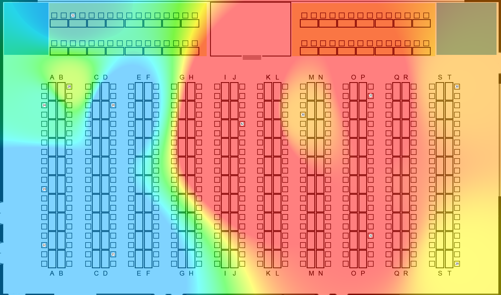

# CXT Heatmap

Der geneigte Besucher der [Convention-X-Treme](https://convention-x-treme) LAN-Party in Karlsdorf-Neuthard weiß, dass es vor Ort gerne mal heiß her geht.

Um zu analysieren wie sich die Temperaturen über das LAN-Party-Wochenende entwickeln, wurde dieses Projekt geboren. Es besteht insgesamt aus vier Repositories:

- [cxt-heatmap](https://github.com/osiris86/cxt-heatmap)
- cxt-heatmap-fe (dieses Repository)
- [cxt-heatmap-sensor](https://github.com/osiris86/cxt-heatmap-sensor)
- [cxt-heatmap-data](https://github.com/osiris86/cxt-heatmap-data)

## CXT Heatmap Frontend

Das Frontend ist eine auf [Svelte](https://svelte.dev/) basierende Implementierung. Es verbindet sich per GraphQL mit dem [Backend](https://github.com/osiris86/cxt-heatmap), um die neuesten Temperaturdaten zu laden. Außerdem abonniert es die bereitgestellte Subscription, um über neue Temperaturaktualisierungen per Websockets informiert zu werden.

Nachdem die neuesten Temperaturdaten geladen wurde, bzw. nach jedem Update, das die Subscription erfährt, wird die Karte mithilfe der (temperatureMap)[https://github.com/optimisme/javascript-temperatureMap] Implementierung aktualisiert. Diese Implementierung wurde jedoch geringfügig angepasst:

- Farben zum Temperaturbereich
- Farbbereich wird bis zum Bildrand gemalt

Neben der reinen Karte im HTML Format bietet das Frontend auch die Möglichkeit, über die gemessenen Temperaturen zu hovern und so die genauen Temperaturen sowie den Messzeitpunkt zu erfahren.
